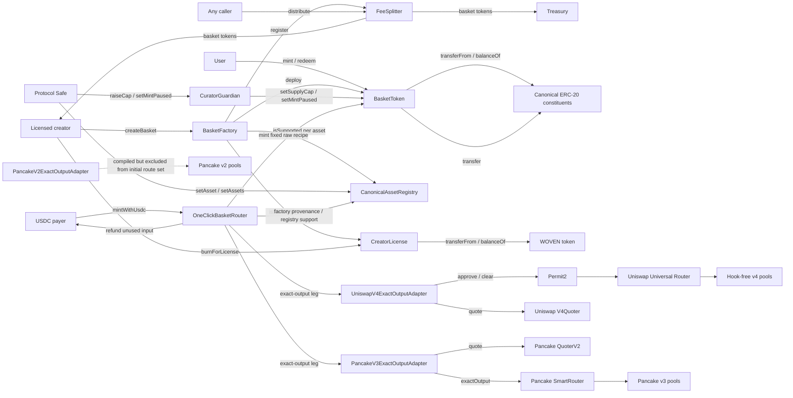
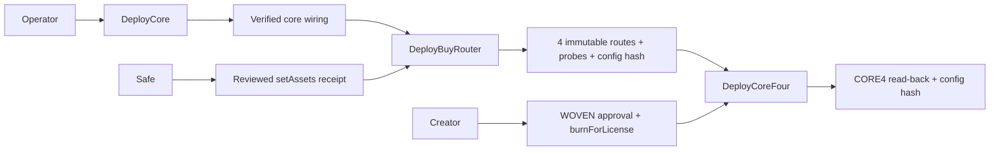

# Function and external-call diagram

Derived from Slither's `function-summary` printer. The complete project-contract
tables are stored in `slither-function-summary.txt`.

Inspection: value-moving paths in `BasketToken`, `CreatorLicense`, and
`FeeSplitter`, the buy router, and every adapter are reentrancy-guarded. The
router accepts only factory-created baskets and constructor-pinned adapter code;
adapters expose constructor-bound routes instead of arbitrary targets or
calldata. Exact debit, output, refund, allowance cleanup, and residual-balance
checks fail closed. The factory makes external calls before and after deployment,
but its registry/license/splitter implementations are immutable deployment
dependencies. Constituent loops in `BasketToken` are bounded to 20 and routed
execution to 8.

Deployment validation is a separate ordering boundary:

None of these script nodes proves a deployment until its signed transaction,
successful receipt, runtime code hash, and post-deployment read-back are recorded.
