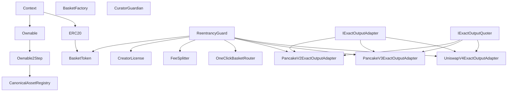

# Inheritance diagram

Generated from Slither's `inheritance-graph` printer. The raw generated graph is
stored in `slither-inheritance-graph.dot`.

Inspection: `BasketToken` combines OpenZeppelin `ERC20` and `ReentrancyGuard`.
Each venue adapter implements the exact-output adapter and quote interfaces and
also inherits `ReentrancyGuard`; the one-click router is reentrancy-guarded as
well. There is no Woven proxy or storage-layout inheritance.
`Ownable2Step`'s `_transferOwnership` override is expected. Slither's generated
graph did not consistently render every adapter interface/guard edge, so those
edges were confirmed directly in source. No unexpected C3 linearization or
project-level shadowing was observed.
