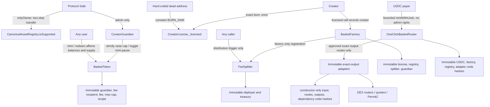

# State variables and authorization diagram

Derived from Slither's `vars-and-auth` printer. The complete project-contract
tables are stored in `slither-vars-and-auth.txt`.

Inspection: manual review confirms `setAsset` and `setAssets` are `onlyOwner`
even though Slither's compact authorization column does not expand that inherited
modifier. Registry ownership renunciation is an explicit reverting override.
Factory-created baskets route guardian authority through a contract that can
only increase caps or toggle minting. The fee recipient is immutable, and
redemption has no pause check. No unprotected production state writer was
identified. The forwarding functions accept a target selected by the Safe, but
reject empty-code and wrong-guardian targets and verify the resulting state
before emitting success. A canonical `BasketToken` executes them only when its
immutable guardian is that exact `CuratorGuardian`.

The one-click router and adapters have no admin setter, pause, rescue, upgrade,
or route-replacement function. Their constructor writes are the only route and
dependency configuration. User calls move session funds but do not grant a
caller persistent authority. ReentrancyGuard's inherited status storage is the
only mutable guard state around those calls. A route incident therefore requires
client-side removal and a newly reviewed immutable deployment rather than an
onchain administrator edit.
